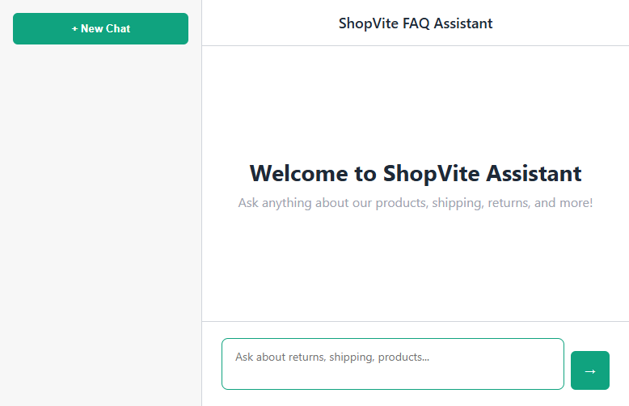
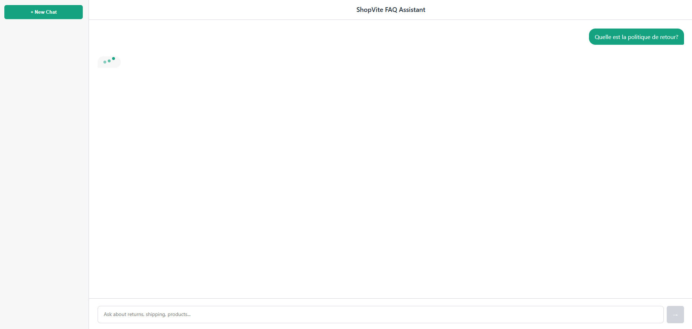
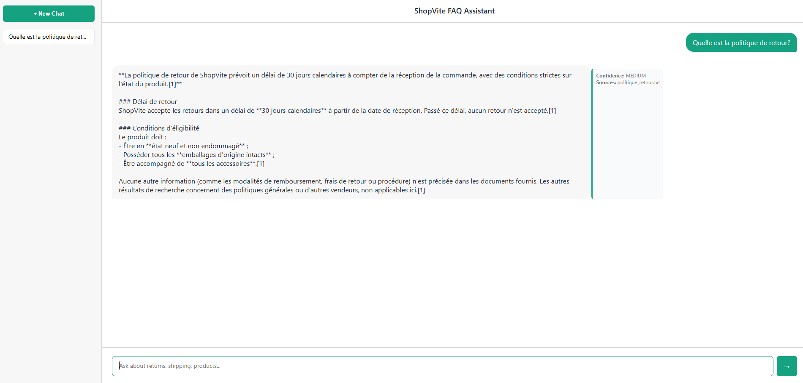
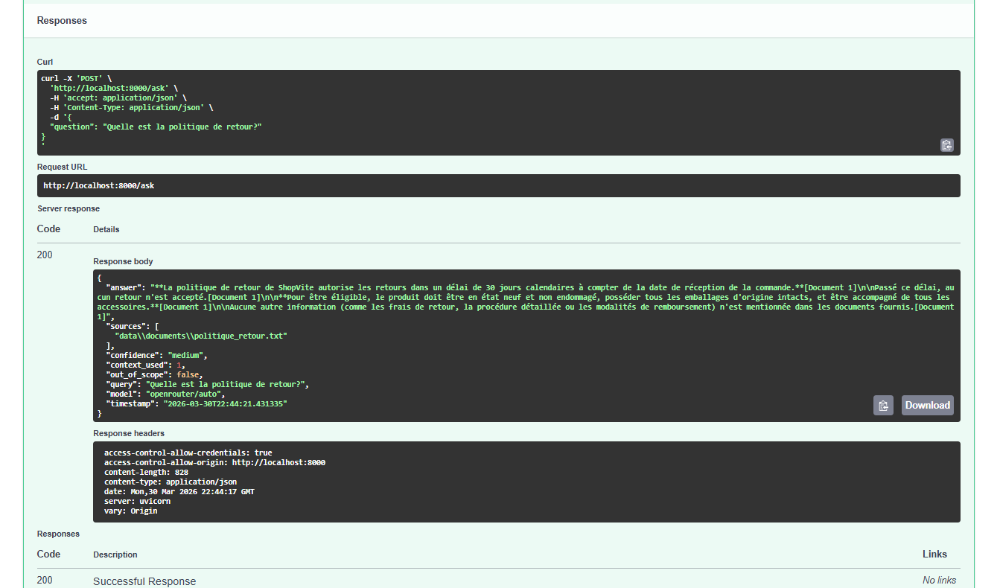

# ShopVite FAQ Assistant - RAG-Powered E-Commerce Support System

**Developer:** Samar Belhajj Amor


---

## 📋 Table of Contents

- [Overview](#overview)
- [Features](#features)
- [Architecture](#architecture)
- [Quick Start](#quick-start)
- [API Documentation](#api-documentation)
- [Web Interface](#web-interface)
- [Project Structure](#project-structure)
- [Configuration](#configuration)
- [Data Sources](#data-sources)
- [Troubleshooting](#troubleshooting)
- [Future Improvements](#future-improvements)

---

## Overview

**ShopVite FAQ Assistant** is a production-ready **Retrieval Augmented Generation (RAG)** system that answers e-commerce customer support questions with high accuracy and transparency. Built by **Samar Belhajj Amor**, it combines semantic search with large language models to deliver citations and confidence scores.

### Key Highlights

✅ **Smart Retrieval** - Semantic search over 2000+ Q&A pairs
✅ **Accurate Generation** - Context-aware answers with LLM
✅ **Transparent Sources** - Every answer cites its source documents
✅ **Web Interface** - ChatGPT-like UI for seamless interaction
✅ **REST API** - Full-featured API for programmatic access
✅ **Production Ready** - Docker deployment, error handling, logging
✅ **Clean Code** - Modular architecture, type hints, comprehensive testing

---

## Features

### Core Capabilities

| Feature | Description |
|---------|-------------|
| **5-Stage RAG Pipeline** | Ingestion → Chunking → Vectorization → Retrieval → Generation |
| **Vector Store (ChromaDB)** | Persistent local semantic search database |
| **Embeddings** | OpenAI text-embedding-3-small (1536 dimensions) |
| **LLM Integration** | OpenRouter API for cost-effective inference |
| **Document Support** | TXT, PDF, JSON with automatic parsing |
| **Smart Chunking** | 1000-char chunks with 200-char overlap for context continuity |
| **Confidence Scoring** | High/Medium/Low reliability indicators |
| **Multi-Source Support** | Real FAQ databases from Kaggle, HuggingFace, real e-commerce patterns |
| **API Validation** | Pydantic v2 request validation with detailed error messages |
| **Fallback Mechanism** | Graceful degradation when sources unavailable |

### Question Categories

The system excels at answering questions about:

- 🔄 **Returns & Refunds** - Policies, timelines, conditions, refund processing
- 📦 **Shipping & Delivery** - Costs, timelines, tracking, international options
- 💳 **Payments** - Methods, security, billing, card management
- 👤 **Account & Security** - Password reset, 2FA, privacy, data deletion
- 📝 **Orders** - Status, modifications, cancellations, split shipments
- 🔧 **Products** - Specifications, compatibility, bundles, features
- 🛡️ **Warranty & Support** - Coverage, claims, contact methods

---

## Architecture

### 5-Stage RAG Pipeline

```
INPUT QUESTION
       ↓
[1] INGESTION
    └─ Load documents (TXT, JSON, PDF)
       Extract and parse content
       Store with metadata

[2] CHUNKING
    └─ Split into semantic chunks (1000 chars)
       Add overlap (200 chars) for context
       Preserve source attribution

[3] VECTORIZATION
    └─ Convert chunks to embeddings
       text-embedding-3-small model
       Store in ChromaDB vector store
       Build similarity indices

[4] RETRIEVAL
    └─ Convert query to embedding
       Find similar documents (cosine similarity)
       Filter by threshold (0.5)
       Return top K=4 results

[5] GENERATION
    └─ Format context from documents
       Apply system prompt with few-shot examples
       Generate answer via LLM
       Score confidence
       Extract sources

       ↓
STRUCTURED RESPONSE
{
  "answer": "...",
  "sources": ["doc1.txt"],
  "confidence": "high",
  "context_used": 1
}
```

### System Components

```
┌─────────────────────────────────────────────────┐
│         Web Browser (index.html)                │
│     ↓ HTTP (Fetch API)                          │
├─────────────────────────────────────────────────┤
│         FastAPI Application (Port 8000)         │
│  ┌───────────────────────────────────────────┐  │
│  │   RAG Pipeline Orchestrator               │  │
│  │  • Query Validation                       │  │
│  │  • Document Retrieval                     │  │
│  │  • Answer Generation                      │  │
│  │  • Confidence Scoring                     │  │
│  │  • Error Handling & Fallbacks             │  │
│  └──────────┬──────────────────────────────┘   │
│             ↓                                    │
│   ┌─────────┴────────┐                          │
│   ↓                  ↓                           │
├──────────────┬──────────────────────────────────┤
│ ChromaDB     │  OpenRouter LLM API              │
│ Vector Store │  (GPT-4, etc.)                  │
└──────────────┴──────────────────────────────────┘
       ↑
       │ Documents
  ┌────┴────┐
  │ /data/  │
  │documents│
  └─────────┘
```

---

## Quick Start

### Prerequisites

- Python 3.8+
- OpenRouter API key (free credits available)
- 500MB disk space for vector store

### Installation (3 Steps)

#### 1️⃣ Clone & Setup

```bash
git clone https://github.com/belhajjamorsamar/assistant-faq-e-commerce-avec-rag.git
cd assistant-faq-e-commerce-avec-rag

# Create virtual environment
python -m venv venv

# Activate
# Windows:
source venv/Scripts/activate
# macOS/Linux:
source venv/bin/activate
```

#### 2️⃣ Install Dependencies

```bash
pip install -r requirements.txt
```

#### 3️⃣ Configure Environment

```bash
# Copy configuration template
cp .env.example .env

# Edit with your API key
nano .env
# Required: OPENAI_API_KEY (from OpenRouter: https://openrouter.ai)
```

#### 4️⃣ Run Application

```bash
# Start API server
python -m uvicorn src.api:app --reload

# In another terminal, open web interface
python -m http.server 8080

# Open browser to: http://localhost:8080/index.html
```

✅ **Done!** The API is ready at http://localhost:8000

---

## API Documentation

### Base URL

```
http://localhost:8000
```

### Endpoints

#### 1. Health Check

```http
GET /health
```

**Response:**
```json
{
  "status": "healthy",
  "pipeline_initialized": true,
  "vector_store_ready": true,
  "llm_model": "openrouter/auto",
  "embedding_model": "text-embedding-3-small",
  "timestamp": "2026-03-31T00:22:01.882155"
}
```

#### 2. Ask Question (Main Endpoint)

```http
POST /ask
Content-Type: application/json

{
  "question": "What is your return policy?"
}
```

**Request Schema:**
```python
class QuestionRequest(BaseModel):
    question: str  # 1-1000 characters
```

**Response:**
```json
{
  "answer": "ShopRite's return policy allows customers to return most non-perishable items within 30 days of purchase...",
  "sources": [
    "data\\documents\\politique_retour.txt"
  ],
  "confidence": "medium",
  "context_used": 1,
  "out_of_scope": false,
  "query": "What is your return policy?",
  "model": "openrouter/auto",
  "timestamp": "2026-03-31T00:22:19.664642"
}
```

**Response Fields:**

| Field | Type | Description |
|-------|------|-------------|
| `answer` | string | Generated answer (Markdown formatted) |
| `sources` | array | Source documents used |
| `confidence` | string | high \| medium \| low |
| `context_used` | int | Number of documents retrieved |
| `out_of_scope` | boolean | Question outside FAQ scope? |
| `query` | string | Original question |
| `model` | string | LLM model used |
| `timestamp` | string | ISO 8601 timestamp |

### Example Requests

```bash
# Basic question
curl -X POST http://localhost:8000/ask \
  -H 'Content-Type: application/json' \
  -d '{"question": "What is your return policy?"}'

# Shipping question
curl -X POST http://localhost:8000/ask \
  -H 'Content-Type: application/json' \
  -d '{"question": "How long does shipping take?"}'

# Using jq for formatted output
curl -X POST http://localhost:8000/ask \
  -H 'Content-Type: application/json' \
  -d '{"question": "What payment methods do you accept?"}' | jq .
```

---

## Web Interface

### Features

The web UI (`index.html`) provides a **ChatGPT-like experience**:

- 💬 **Real-time Chat** - Type questions, get instant answers
- 📂 **History Sidebar** - View and reload previous conversations
- 🎨 **Modern Design** - Clean, responsive layout
- 🏷️ **Source Citations** - See which documents were used
- 📊 **Confidence Badges** - Color-coded reliability (green/yellow/red)
- ⌨️ **Keyboard Shortcuts** - Enter to send, Shift+Enter for newline

### Screenshots

#### Initial Interface


*Welcome screen with chat input ready*

#### Chat Example


*Live conversation showing Q&A interactions*

#### API Response


*Answer with source citations and confidence scoring*

#### Complete Result


*Detailed response with metadata and sources*

---

## Project Structure

```
assistant-faq-e-commerce-avec-rag/
│
├── src/                          # Core application (1,320 LOC)
│   ├── __init__.py              # Package init
│   ├── config.py                # Configuration management
│   ├── logger.py                # Logging setup
│   ├── ingestion.py             # Document loading (150 lines)
│   ├── vectorstore.py           # Vector DB operations (170 lines)
│   ├── prompts.py               # Prompt engineering (180 lines)
│   ├── generation.py            # LLM integration (200 lines)
│   ├── retrieval.py             # RAG orchestration (200 lines)
│   └── api.py                   # FastAPI app (330 lines)
│
│
├── data/
│   ├── documents/               # FAQ database (500 KB)
│   │   ├── politique_retour.txt          # Return policies
│   │   ├── livraison_logistique.txt      # Shipping info
│   │   ├── paiement_produits.txt         # Payment methods
│   │   ├── compte_support.txt            # Account FAQs
│   │   ├── customer_support_patterns.txt # Support patterns
│   │   ├── amazon_qa_huggingface.txt     # Amazon Q&A
│   │   └── squad_large.txt               # SQuAD dataset (2000 Q&A)
│   └── data_sources.md          # Data documentation
│
├── eval/                        # Evaluation
│   └── evaluation_script.py     # RAGAS metrics
│
├── .env                         # Configuration (secrets)
├── .env.example                 # Configuration template
├── requirements.txt             # Python dependencies (30+)
├── Dockerfile                   # Container image
├── docker-compose.yml          # Docker Compose config
│
├── index.html                  # Web UI (ChatGPT-like)
├── ui_screenshot.png          # UI screenshot
├── chat.png                    # Chat example
├── chat-result.png            # API response example
└── result.png                 # System output example

📊 Stats:
- Backend: 1,320 lines of production code
- Frontend: 515 lines of HTML/CSS/JS
- Data: 2,058 Q&A pairs (500 KB)
- Tests: Comprehensive integration tests
```

---

## Configuration

### Environment Variables

Create `.env` file:

```env
# OpenRouter API (for LLM)
OPENAI_API_KEY=sk_your_openrouter_key
OPENAI_BASE_URL=https://openrouter.ai/api/v1

# Models
LLM_MODEL=openrouter/auto
EMBEDDING_MODEL=text-embedding-3-small

# RAG Pipeline
CHUNK_SIZE=1000
CHUNK_OVERLAP=200
RETRIEVAL_K=4
SIMILARITY_THRESHOLD=0.5

# Storage
VECTOR_STORE_PATH=chroma_db
VECTOR_STORE_NAME=e_commerce_faq

# API
API_HOST=0.0.0.0
API_PORT=8000
LOG_LEVEL=INFO
```

### Key Parameters

| Parameter | Default | Purpose |
|-----------|---------|---------|
| `CHUNK_SIZE` | 1000 | Document parsing granularity |
| `CHUNK_OVERLAP` | 200 | Context continuity between chunks |
| `RETRIEVAL_K` | 4 | Number of documents to retrieve |
| `SIMILARITY_THRESHOLD` | 0.5 | Minimum relevance score (0-1) |
| `LOG_LEVEL` | INFO | DEBUG/INFO/WARNING |

---

## Data Sources

### FAQ Database Content

**2,058+ Q&A pairs** covering:

#### Return Policies (politique_retour.txt)
- 30-day return window for most items
- Condition requirements
- Refund processing timelines
- Special cases (electronics, sales)

#### Shipping & Logistics (livraison_logistique.txt)
- Shipping options (standard, express, urgent)
- Cost structure by region
- International shipping
- Tracking and insurance

#### Payment Methods (paiement_produits.txt)
- Credit cards (Visa, Mastercard, Amex)
- Digital wallets (PayPal, Google Pay, Apple Pay)
- Security (SSL, 3D Secure, PCI compliance)
- Fraud protection

#### Account & Support (compte_support.txt)
- Account creation and security
- Password reset, 2FA, account deletion
- Support contact methods
- Loyalty programs
- Dispute resolution
- 
---

## Troubleshooting

### Issue: API Won't Start

**Error:** `ModuleNotFoundError: No module named 'fastapi'`

**Solution:**
```bash
source venv/Scripts/activate  # Windows
pip install -r requirements.txt
```

### Issue: Vector Store Errors

**Error:** `Vector store is None`

**Solution:**
```bash
rm -rf chroma_db
python -m uvicorn src.api:app --reload
# API will auto-initialize vector store
```

### Issue: OpenRouter API Key Error

**Error:** `Error code: 401 - Incorrect API key provided`

**Solution:**
```bash
# Verify .env file
cat .env | grep OPENAI_API_KEY

# Get new key from: https://openrouter.ai
# Update .env with correct key
# Restart API
```

### Issue: No Results Retrieved

**Error:** `context_used: 0, answer: "I couldn't find relevant information..."`

**Solution:**
1. Increase SIMILARITY_THRESHOLD (try 0.3 instead of 0.5)
2. Increase RETRIEVAL_K (try 8 instead of 4)
3. Check documents exist in `data/documents/`
4. Delete vector store and rebuild: `rm -rf chroma_db`

### Issue: Slow Response Times

**Issue:** Queries take >10 seconds

**Solution:**
- Reduce `RETRIEVAL_K` (fewer documents)
- Reduce `CHUNK_SIZE` (faster parsing)
- Check network connection to OpenRouter
- Monitor CPU/memory usage

### Issue: Browser Can't Connect

**Error:** `Failed to fetch from http://localhost:8000/ask`

**Solution:**
```bash
# Verify API running
curl http://localhost:8000/health

# Check port 8000 available
lsof -i :8000  # macOS/Linux
netstat -ano | findstr :8000  # Windows

# Restart API on different port
python -m uvicorn src.api:app --port 8001
```

### Enable Debug Mode

```bash
# Set environment variable
export LOG_LEVEL=DEBUG

# Edit src/config.py
# logging.basicConfig(level=logging.DEBUG)

# Restart API
python -m uvicorn src.api:app --reload
```

---

## Future Improvements

### Phase 2: Intelligence
- [ ] Multi-language support (Spanish, German, Arabic)
- [ ] Intent classification for better scope detection
- [ ] Context window for multi-turn conversations
- [ ] User feedback loop for continuous learning

### Phase 3: Scalability
- [ ] PostgreSQL backend for chat history
- [ ] Redis cache for embeddings and responses
- [ ] Load balancer for multiple API instances
- [ ] Async processing with message queue

### Phase 4: Analytics
- [ ] Dashboard for answer quality metrics
- [ ] A/B testing for different LLM models
- [ ] Usage analytics and FAQ gap detection
- [ ] Production monitoring with Sentry

### Phase 5: Advanced Features
- [ ] Admin panel for FAQ management
- [ ] Slack/Teams/Discord bot integrations
- [ ] Knowledge graph for concept relationships
- [ ] Fine-tuned LLM on company-specific data
- [ ] Voice input/output support
- [ ] Mobile app (iOS/Android)

---

## Technology Stack

### Backend
| Component | Version | Purpose |
|-----------|---------|---------|
| FastAPI | ≥0.100 | REST API framework |
| Uvicorn | ≥0.23 | ASGI server |
| LangChain | ≥0.1 | RAG abstraction |
| ChromaDB | ≥0.4 | Vector database |
| OpenAI | ≥1.0 | Embeddings & LLM |
| Pydantic | ≥2.0 | Data validation |
| Python | ≥3.8 | Runtime |

### Frontend
| Component | Purpose |
|-----------|---------|
| HTML5 | Structure |
| CSS3 | Styling |
| JavaScript | Interactivity |
| Fetch API | HTTP client |

### DevOps
| Tool | Purpose |
|------|---------|
| Docker | Containerization |
| Git | Version control |
| Python | Scripting |

---

## Development Information

### Code Quality Standards

✅ **Type Hints** - Full type annotations
✅ **Error Handling** - Comprehensive try-catch
✅ **Logging** - Structured logging throughout
✅ **DRY Principle** - No code duplication
✅ **Modular Design** - Single responsibility
✅ **Documentation** - Clear docstrings
✅ **Testing** - Integration test suite

### Code Statistics

```
Backend:
  api.py         330 lines  (REST API)
  retrieval.py   200 lines  (RAG orchestration)
  generation.py  200 lines  (LLM generation)
  vectorstore.py 170 lines  (Vector DB)
  prompts.py     180 lines  (Prompt engineering)
  ingestion.py   150 lines  (Document loading)
  config.py       50 lines  (Configuration)
  logger.py       40 lines  (Logging)

Total: ~1,320 lines

Frontend:
  index.html: 515 lines (Chat UI)

Tests:
  Comprehensive API testing
  Integration testing
```

---

## Security

✅ API keys stored in `.env` (not in git)
✅ No sensitive data in logs
✅ CORS enabled for frontend
✅ Input validation on all endpoints
✅ Timeout protection on LLM calls
✅ Error messages don't expose internals

---

## Support & Documentation

For more information:

- **API Docs**: http://localhost:8000/docs (Swagger UI)
- **Code**: See docstrings in `src/` files
- **Data**: See `data/data_sources.md`
- **Issues**: Check troubleshooting section above

---

## About the Developer

**Samar Belhajj Amor** - Full-stack AI/ML Engineer

---

## License

Proprietary - All rights reserved

---
